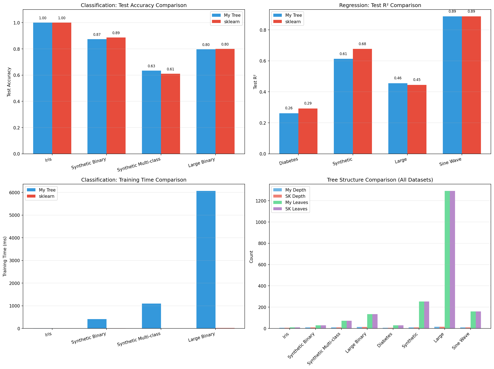
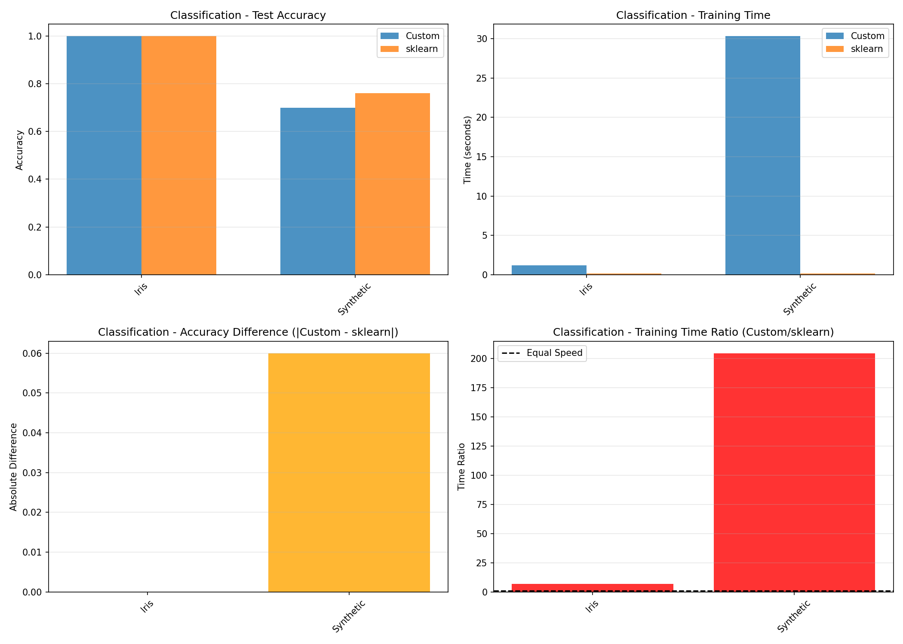

# RandomForest-GBM

Unified repository for the team's ensemble-learning implementations: a modular CART Decision Tree, a Random Forest ensemble and a Gradient Boosting Machine (GBM) implementation. This README summarizes each module, shows quick start examples, and testing instructions notes so teammates can evaluate results consistently.

---

**Contents (high level)**

- `decision_tree/` — Member 1: standalone CART Decision Tree implementation (classification & regression). Ready and tested.
- `random_forest/` — Member 2: Random Forest ensemble built from the `decision_tree` base learner.
- `gradient_boosting/` — Member 3: Gradient Boosting Machine implementation using shallow `decision_tree` learners.
- `tests/` — Unit and integration tests comparing results against `scikit-learn`.
- `images/` — Plots produced by test/bench scripts.

---

**Project goals**

- Provide a clear, educational implementation of CART and two ensemble methods (RF, GBM).
- Ensure modular code that can be reused as a base learner (`decision_tree`) for `random_forest` and `gradient_boosting`.
- Maintain test parity with `scikit-learn` for correctness and benchmark performance.

---

**Quick links**

- Decision Tree docs: `decision_tree/README.md`
- Random Forest docs: `random_forest/README.md`
- Gradient Boosting docs: `gradient_boosting/README.md`

---

**Installation**

Prerequisites (recommended):

```powershell
pip install numpy scikit-learn matplotlib
```

Run tests and examples from the project root.

---

**Quick Start — Decision Tree (example)**

```python
from decision_tree import DecisionTree
from sklearn.datasets import load_iris

X, y = load_iris(return_X_y=True)
clf = DecisionTree(max_depth=5, criterion='gini')
clf.fit(X, y)
preds = clf.predict(X)
print('Accuracy:', (preds == y).mean())
```

**Quick Start — Random Forest (example)**

```python
from random_forest.forest import RandomForest
from sklearn.datasets import load_iris

X, y = load_iris(return_X_y=True)
rf = RandomForest(n_estimators=100, max_features='sqrt', random_state=42)
rf.fit(X, y)
print('RF accuracy:', rf.score(X, y))
```

**Quick Start — GBM (example)**

```python
from gradient_boosting.gbm import GradientBoostingRegressor
from sklearn.datasets import make_regression

X, y = make_regression(n_samples=500, n_features=10, noise=10, random_state=42)
gbm = GradientBoostingRegressor(n_estimators=100, learning_rate=0.1, max_depth=3)
gbm.fit(X, y)
print('GBM MSE:', ((gbm.predict(X) - y) ** 2).mean())
```

---

**Module summaries**

- `decision_tree/` (Author: Wiame)
    - CART-style implementation for classification and regression.
    - Criteria: `gini`, `entropy` (classification), `mse` (regression).
    - Modes: `max_features=None` (DETERMINISTIC, GBM-style) and `max_features='sqrt'` (RANDOMIZED, RF-style).
    - Files: `tree.py`, `node.py`, `splitter.py`, `metrics.py`, `tests.py`.

- `random_forest/` (Author: Abdellah)
    - Ensemble of `DecisionTree` base learners using bagging + feature subsampling.
    - Exposes `RandomForest` class with `fit`, `predict`, `score`, and `feature_importances_`.
    - Supports OOB estimation when `bootstrap=True`.

- `gradient_boosting/` (Author: Saif)
    - Implements stage-wise additive training using shallow `DecisionTree` regressors/classifiers.
    - Loss functions: squared error, absolute error, log-loss for classification.
    - Exposes staged predictions and `predict_proba` for classifiers.

---

**Mathematical highlights (short)**

- Gini impurity (classification): $G(t)=1-\\sum_k p_k^2$
- Entropy (classification): $H(t)=-\\sum_k p_k \\log p_k$
- MSE (regression): $\\mathrm{MSE}(t)=\\frac{1}{n}\\sum_i (y_i-\\bar y)^2$
- Impurity decrease for a split: $\\Delta I = I_{parent} - \\frac{n_L}{n}I_L - \\frac{n_R}{n}I_R$
- RF variance reduction intuition: $\\mathrm{Var}(\\hat f_{ens})=\\rho\\sigma^2+(1-\\rho)\\sigma^2/M$

---

**Testing & benchmarking**

From project root run the main tests:

```powershell
# Decision tree tests
python decision_tree/tests.py

# Random forest tests (examples)
python random_forest/test_forest_vs_sklearn.py

# GBM tests
python gradient_boosting/test_gbm.py
```

Performance note: our implementations are NumPy-vectorized Python code — accuracy is comparable to `scikit-learn` on tested datasets, but `scikit-learn` is significantly faster on large datasets due to C/C++ optimizations.

---

**Comparison images**

We include pre-generated comparison plots (our implementation vs scikit-learn) for each module. Open the images in `images/comparison/`.

- Decision Tree vs sklearn: `images/comparison/my_tree_vs_sklearn.png` (summary) and `my_tree_vs_sklearn_detailed.png`
- Random Forest vs sklearn: `images/comparison/comparison_classification.png` and `images/comparison/comparison_regression.png`
- GBM vs sklearn: `images/comparison/my_gbm_vs_sklearn.png` and `my_gbm_vs_sklearn_detailed.png`

Examples (embedded):






**License**

MIT License — see `LICENSE`.

---

