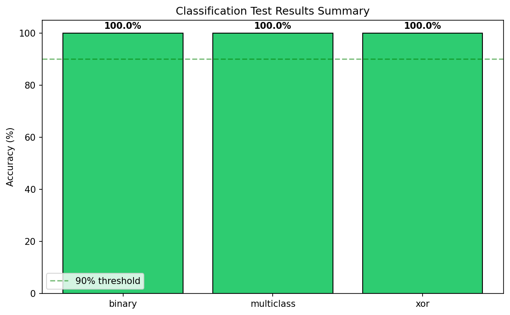
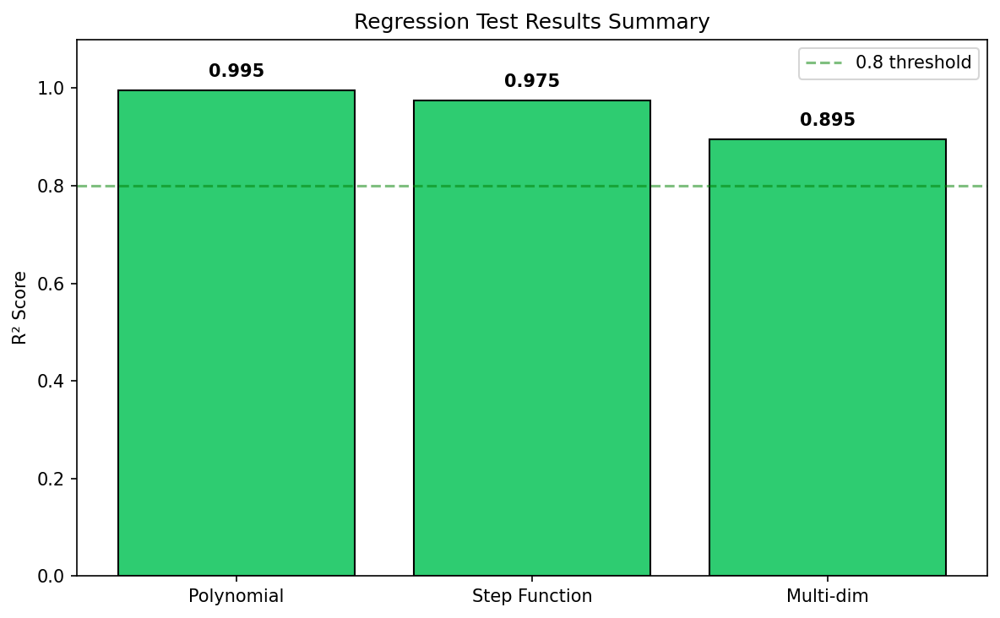

# 🌲 RandomForest-GBM Project

A complete implementation of **Random Forest** and **Gradient Boosting Machine** algorithms based on **Breiman (2001)** paper: *"Random Forests"* and the foundational GBM literature.

## 📁 Project Structure

```
RandomForest-GBM/
├── decision_tree/              # Member 1: CART Decision Tree (READY ✅)
│   ├── __init__.py             # Package exports
│   ├── node.py                 # Node class with exact 5 attributes
│   ├── metrics.py              # Impurity functions (gini, entropy, mse)
│   ├── splitter.py             # Vectorized split finding
│   └── tree.py                 # Main DecisionTree class
│
├── random_forest/              # Member 2: Random Forest (TODO 📋)
│   ├── __init__.py             # Package exports
│   ├── forest.py               # RandomForest class (TODO)
│   └── README.md               # Implementation guide for Member 2
│
├── gradient_boosting/          # Member 3: GBM (TODO 📋)
│   ├── __init__.py             # Package exports
│   ├── gbm.py                  # GradientBoostingMachine class (TODO)
│   └── README.md               # Implementation guide for Member 3
│
├── tests/                      # Test files
│   ├── test_classification_tree.py
│   ├── test_regression_tree.py
│   └── my_tree_vs_sklearn.py
│
├── images/                     # Test visualizations
│   ├── classification/         # Classification test plots
│   ├── regression/             # Regression test plots
│   └── comparison/             # sklearn comparison plots
│
├── .github/workflows/          # CI/CD workflows
│   └── ci.yml                  # Automated testing & protected files
│
├── .gitignore                  # Git ignore rules
├── CONTRIBUTING.md             # Contribution guidelines & team rules
├── decision_tree_spec.md       # Original specification
└── README.md                   # This file
```

## Team Members

| Member | Task | GitHub | Status |
|--------|------|--------|--------|
| **Wiame** | CART Decision Tree | [@WE2722](https://github.com/WE2722) | Complete |
| **Abdellah** | Random Forest (Breiman 2001) | [@AbdellahBaqua](https://github.com/AbdellahBaqua) | TODO |
| **Saif** | Gradient Boosting Machine | [@Saif-dbot](https://github.com/Saif-dbot) | TODO |

---

## 🌳 Decision Tree Module (Member 1) - READY TO USE

### Quick Start

```python
from decision_tree import DecisionTree

# Classification
clf = DecisionTree(max_depth=5, criterion='gini')
clf.fit(X_train, y_train)
predictions = clf.predict(X_test)
probabilities = clf.predict_proba(X_test)

# Regression
reg = DecisionTree(max_depth=5, criterion='mse')
reg.fit(X_train, y_train)
predictions = reg.predict(X_test)
```

### Class Signature (DO NOT MODIFY)

```python
DecisionTree(
    max_depth=None,           # Maximum tree depth (None = unlimited)
    min_samples_split=2,      # Minimum samples to split a node
    min_samples_leaf=1,       # Minimum samples in a leaf
    criterion='gini',         # 'gini', 'entropy' (classification) or 'mse' (regression)
    max_features=None,        # Feature selection: None, 'sqrt', 'log2', int, float
    random_state=None         # For reproducibility
)
```

### Two Operating Modes

| Mode | max_features | Use Case | Description |
|------|--------------|----------|-------------|
| **DETERMINISTIC** | `None` | GBM | Considers ALL features at each split |
| **RANDOMIZED** | `'sqrt'` | Random Forest | Samples features WITHOUT replacement |

### Key Methods

| Method | Returns | Description |
|--------|---------|-------------|
| `fit(X, y)` | `self` | Train the tree |
| `predict(X)` | `ndarray` | Class labels or regression values |
| `predict_proba(X)` | `ndarray` | Class probabilities (classification only) |
| `get_depth()` | `int` | Actual tree depth |
| `get_n_leaves()` | `int` | Number of leaf nodes |

### Key Attributes (after fitting)

| Attribute | Type | Description |
|-----------|------|-------------|
| `root_` | `Node` | Root node of the tree |
| `n_features_` | `int` | Number of features |
| `n_classes_` | `int` | Number of classes (classification) |
| `classes_` | `ndarray` | Unique class labels |
| `feature_importances_` | `ndarray` | Feature importance scores |
| `task_type_` | `str` | `'classification'` or `'regression'` |

### Node Structure (5 EXACT attributes)

```python
class Node:
    feature_index: int    # -1 if leaf node
    threshold: float      # Split threshold (None for leaf)
    left_child: Node      # Left subtree (None for leaf)
    right_child: Node     # Right subtree (None for leaf)
    leaf_value: Any       # Prediction value (None for internal)
```

---

## 📊 Test Results

### Classification Performance


### Regression Performance


### Comparison with sklearn


**Result: ✅ Comparable performance to sklearn's DecisionTree!**

---

## 🚀 Getting Started

### Prerequisites

```bash
pip install numpy matplotlib scikit-learn
```

### Run Tests

```bash
# Classification tests
python tests/test_classification_tree.py

# Regression tests
python tests/test_regression_tree.py

# sklearn comparison
python tests/my_tree_vs_sklearn.py
```

---

## 📚 References

- Breiman, L. (2001). *Random Forests*. Machine Learning, 45(1), 5-32.
- Breiman, L., Friedman, J., Stone, C. J., & Olshen, R. A. (1984). *Classification and Regression Trees*. CRC Press.
- Friedman, J. H. (2001). *Greedy Function Approximation: A Gradient Boosting Machine*. Annals of Statistics.

---

## 📜 License

MIT License - See LICENSE file for details.
